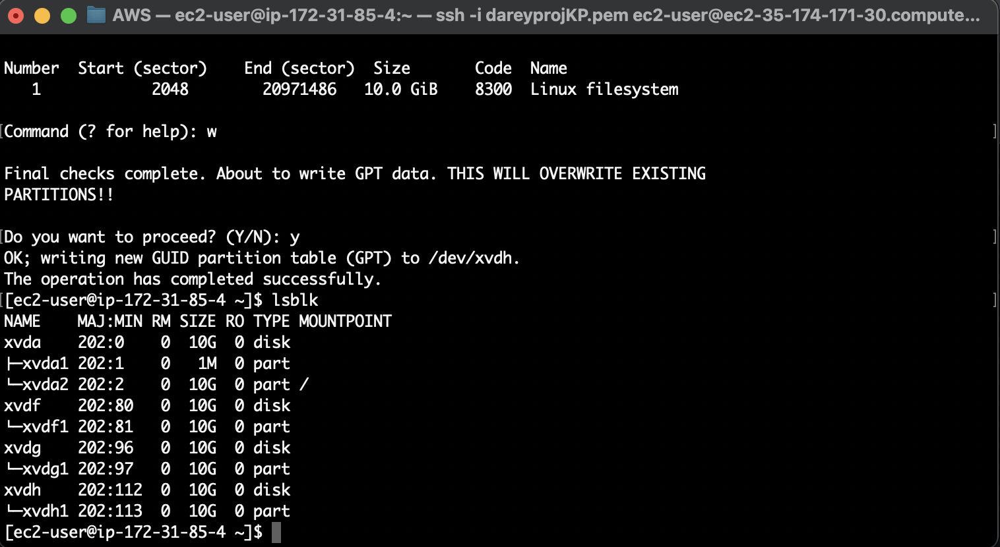
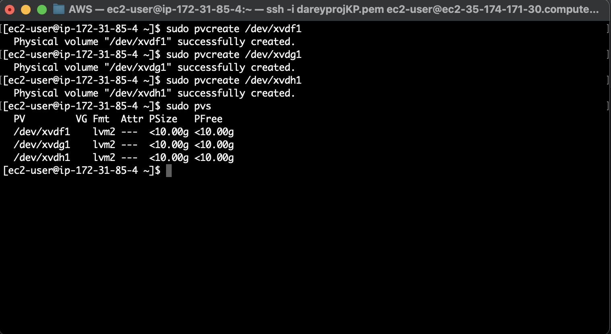
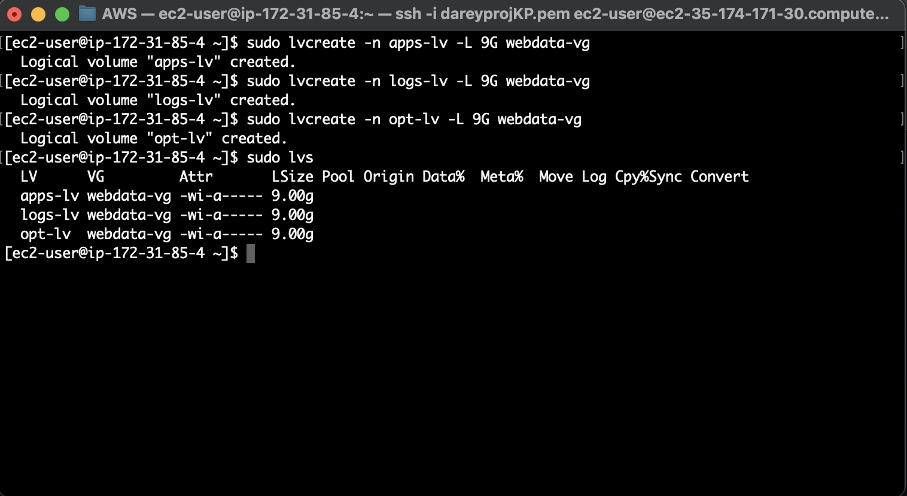
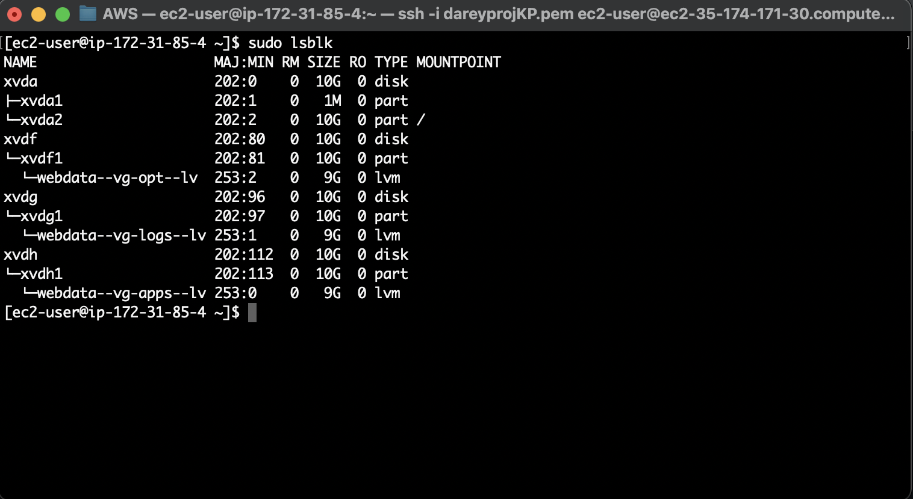

# DEVOPS TOOLING WEBSITE SOLUTION

The website will display a dashboard of some of the most useful DevOps tools as listed below:

- Jenkins
- Kubernetes
- JFrog Artifactory
- Rancher
- Docker
- Grafana
- Prometheus
- Kibana


The solution consists of the following components:

1. Infrastructure: AWS
2. Web Server : Red Hat Enterprise Linux 8
3. Database Server: Ubuntu 20.04 + MySQL
4. Storage Server: Red Hat Enterprise Linux 8 + NFS Server
5. Programming Language: PHP
6. Code Repository: GitHub


## PREPARE THE NFS SERVER

- Launch an EC2 instance with RHEL that will serve as "NFS Server".
- Attach three volumes with the the same availability.
- Inspect what block devices are attached to the server.

```
lsblk
```

Use gdisk utility to create a single partition on each of the 3 disks.

```
sudo gdisk /dev/xvdf

sudo gdisk /dev/xvdg

sudo gdisk /dev/xvdh
```




Install lvm2:

```
sudo yum install lvm2
```

Use the pvcreate utility to mark each of 3 disks as physical volumes (PVs) to be used by LVM:

```
sudo pvcreate /dev/xvdf1
sudo pvcreate /dev/xvdg1
sudo pvcreate /dev/xvdh1
```

Add all 3 PVs to a volume group:

```
sudo vgcreate webdata-vg /dev/xvdh1 /dev/xvdg1 /dev/xvdf1
```

Verify that the VG has been created successfully:

```
sudo vgs
```



Create 3 logical volumes. apps-lv, and logs-lv. apps-lv will be used to store data for the Website while, logs-lv will be used to store data for logs.

```
sudo lvcreate -n apps-lv -L 9G webdata-vg
sudo lvcreate -n logs-lv -L 9G webdata-vg
sudo lvcreate -n opt-lv -L 9G webdata-vg
```

Verify that the Logical Volume had been created successfully:


```
sudo lvs
```



Confirm the whole set:

```
sudo vgdisplay -v #view complete setup - VG, PV, and LV

sudo lsblk 
```



Use `mkfs.xfs` to format the logical volumes with xfs filesystem with the commands below:

```
sudo mkfs -t xfs /dev/webdata-vg/apps-lv
sudo mkfs -t xfs /dev/webdata-vg/logs-lv
sudo mkfs -t xfs /dev/webdata-vg/opt-lv
```

Create mount points on /mnt directory for the logical volumes:

```
sudo mkdir /mnt/apps

sudo mkdir /mnt/apps

sudo mkdir /mnt/opt 
```

